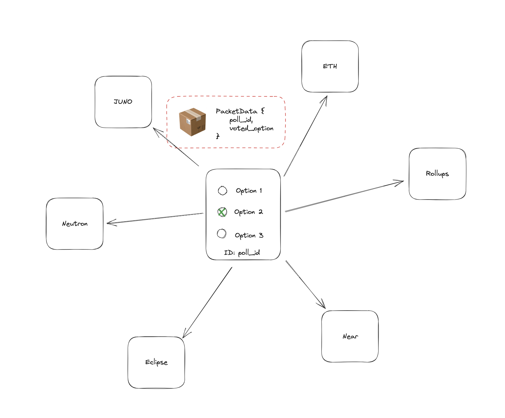

# AwesomWasm workshop

This repo was created to support the workshop at the AwesomeWasm conference July 12-13 2023 in Berlin. It focuses on developing IBC enabled CosmWasm smart contracts and looking at different tools to accelerate development environment to quickly test and iterate on contract designs with IBC SDK (or Starship).

## Context

- CosmWasm was developed with IBC in mind and to enable a natively multi-chain/cross-chain smart contract development platform. Yet, we're only at the very start of seeing interoperable contracts or dApps take off.
- Polymer, through _virtual IBC_ accelerates IBC extensibility and thus adoption. Check out [this workshop at Gateway to Cosmos](https://www.youtube.com/watch?v=4vLGwzjRaJ8) to find out more.
- IBC SDK is multichain development tooling aimed to streamline the development of IBC applications (Cosmos SDK modules, contracts,...): it was initially developed with using Polymer as a middle hop in multi-hop IBC in mind. However, integration with [Starship](https://github.com/cosmology-tech/starship/tree/main) expands the reach of both.

Polymer will launch with support between Ethereum and Cosmos (including CosmWasm) chains. This opens up the design space for IBC app developers to enable cross-chain applications between CW and EVM contracts.

In this workshop, we'll prep for that by looking at how to create a simple polling (voting) contract that allows to create polls, vote on polls and when the poll is ended we can send an IBC packet with the voting information to then be used by other applications on a different chain.

<!-- insert diagram -->



Find the associated documentation to develop IBC enabled CW contracts [here](https://github.com/tmsdkeys/ibc-sdk-docs/tree/main/docs/dev-environment/CosmWasm).

## Code overview

I've started out from the tutorial in the [ibc-go repo wiki](https://github.com/cosmos/ibc-go/wiki/Cosmwasm-and-IBC). It's a very simple template of an IBC enabled CW contract. I'd recommend to use this or a similar one when starting to develop an IBC enabled contract.

For the polling app itself, I've used this [tutorial on SparkIBC's YT channel](https://www.youtube.com/watch?v=ocR-1FvIQD8) as a start. In this workshop we won't be paying too much attention to the non-IBC logic.

The different steps have been highlighted by these commits, you could do a `git diff`` to observe all of the steps.

```git

commit 422c046d841eb6f29272a801d58f135e183575d2

    update AckPacket logic and review RecvPacket logic

commit 32ed085167cd70e9424196d2b3cd6bbab323ca5a

    add SendPacket logic

commit f6ab36afd10be0125b06c688f98d08714782f68d

    define packet data

commit 98883ae302e583cd95ded5d3edbaae3cbc3fb821

    Section 0: add polling logic

commit 00d8123c37063c921afc8943ae7165f4169d2773
    prep ibc messenger for ibc-sdk tutorial
```

## Next steps

So now that you've created this contract that can send poll info cross-chain, what to do next? There's a couple of things you could do, including some improvements:

- build tests for the contract
- build a contract on the receiving chain that uses the poll IBC packet data
- build your very own IBC enabled contracts implementing application flow
- use Starship to quickly spin up your dev environment

a little more advanced:

- introduce Interchain accounts somewhere in your application flow, see [CosmWasm ICA controller](https://github.com/srdtrk/cw-ica-controller/tree/main) to control accounts on a Cosmos SDK chain
- use [ADR-8](https://medium.com/the-interchain-foundation/actor-callbacks-unlock-interchain-composable-apps-5c8c5e9324bd) to implement actor callbacks that call into other IBC apps (often ICS20 or ICS27)

and of course:

- IBC SDK will be open sourced really soon, so you can already go through the conceptual part of the docs linked above and already start prepping your Solidity contracts to interact with (write your orwn or find the ABI of the contracts you want to target)
